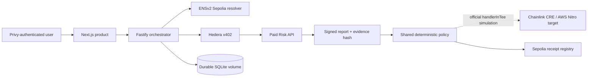

# AgentDock

AgentDock combines an **AI-agent service marketplace** with a **policy-controlled execution and evidence layer**. Providers publish services with verifiable identities, declared capabilities, machine-readable endpoints, and transparent prices. Users discover those services and run them through durable workflows that constrain who may act, what may be purchased, and which policy must pass before completion.

Each execution produces an inspectable trail: authenticated ownership, ENS authority, explicit payment consent, x402 settlement, signed delivery evidence, a deterministic policy decision, and an onchain receipt. AgentDock therefore turns agent-to-agent commerce from an opaque API call into a bounded and auditable product workflow.

- **Live product:** https://agentdock-web-pi.vercel.app
- **Service catalog:** https://agentdock-web-pi.vercel.app/services
- **Workflow console:** https://agentdock-web-pi.vercel.app/workflow
- **Provider console:** https://agentdock-web-pi.vercel.app/providers

## Judge navigation

Jump directly to the relevant product or prize-track implementation:

- [Product flow](#product-flow)
- [Chainlink CRE confidential policy](#chainlink-cre-confidential-policy)
- [Hedera x402 payments](#hedera-x402-payments)
- [ENSv2 agent authority](#ensv2-agent-authority)
- [Sepolia evidence receipts](#sepolia-evidence-receipts)
- [Verified end-to-end evidence](#verified-end-to-end-evidence)
- [Run the complete product locally](#run-the-complete-product-locally)
- [Run the CRE simulation locally](#run-the-cre-simulation-locally)
- [Demo recording script](./docs/DEMO_SCRIPT.md)

## Prize-track integrations

### Chainlink CRE confidential policy

AgentDock wraps its deterministic private-policy evaluator with Chainlink CRE [`handlerInTee`](./integrations/chainlink-cre/agentdock-policy/main.ts), targeting AWS Nitro in `us-west-2`. The runnable, secret-free CRE project is committed under [`integrations/chainlink-cre`](./integrations/chainlink-cre), while the evaluator shared with the orchestrator lives in [`packages/domain/src/policy.ts`](./packages/domain/src/policy.ts).

**Status:** official CRE simulator verified. Chainlink confirmed confidential-workflow simulation is accepted for judging; live confidential deployment remains access-gated. AgentDock does not claim that the browser-triggered execution currently runs in a deployed enclave.

### Hedera x402 payments

The paid Risk API issues an x402 quote on `hedera:testnet`. The orchestrator accepts only native HBAR (`0.0.0`), the expected network and recipient, and a maximum of exactly `10,000` tinybars. Payment requires explicit user confirmation. The durable workflow stores the x402 `PAYMENT-RESPONSE` transaction reference and does not request delivery before settlement.

- Client and spend guard: [`apps/api/src/risk-client.ts`](./apps/api/src/risk-client.ts)
- Settlement verification: [`packages/hedera/src/payment.ts`](./packages/hedera/src/payment.ts)
- x402-protected provider: [`apps/risk-api/src/x402.ts`](./apps/risk-api/src/x402.ts)
- [Verified HashScan transaction](https://hashscan.io/testnet/transaction/0.0.9185802@1789310877.433059891)

### ENSv2 agent authority

Before spend is enabled, the orchestrator resolves the agent's Sepolia ENS records and verifies its role, requested capability, endpoint, network scope, expiry, revocation state, and policy hash. Providers must pass the same live checks before their service can be published.

- Authority adapter: [`packages/ens/src/authority.ts`](./packages/ens/src/authority.ts)
- Registered name: `agentdock.eth`
- [ENS registration transaction](https://sepolia.etherscan.io/tx/0xafeb6fd38bce553be3a83f0e692fca9d25fe3be6d6f2f66d86023b3fe98ba48d)
- [ENS record proof transaction](https://sepolia.etherscan.io/tx/0x5c69c7c0cdcaedd711b095124cddfbfd8d895abf6b76956090915abf7e1894c3)

### Sepolia evidence receipts

Terminal policy decisions are written to [`WorkflowReceiptRegistry`](./packages/contracts/contracts/WorkflowReceiptRegistry.sol). The contract stores hashes, namehashes, status, and payment references instead of private report or policy data.

- Registry: [`0x70fa78b86d6e1992989c98ddcbf61162a80a8c06`](https://sepolia.etherscan.io/address/0x70fa78b86d6e1992989c98ddcbf61162a80a8c06)
- [Verified receipt transaction](https://sepolia.etherscan.io/tx/0x466d5ec559b09d626db5d0d2b39195765b74739fd52b49069b9030666286bdfe)

## Integration status

| Layer           | Implementation                                                             | Status                          |
| --------------- | -------------------------------------------------------------------------- | ------------------------------- |
| Authentication  | Privy email/wallet login and server JWT verification                       | Live                            |
| Agent authority | ENSv2 resolver text records on Sepolia                                     | Live                            |
| Marketplace     | Durable provider catalog with authenticated ownership                      | Live                            |
| Payment         | Hedera testnet x402, capped at 10,000 tinybars per report                  | Live                            |
| Delivery        | EVM balance report with SHA-256 evidence hash and Ed25519 signature        | Live                            |
| Policy          | Shared deterministic evaluator executed by the CRE `handlerInTee` workflow | Official CRE simulator verified |
| Receipt         | `WorkflowReceiptRegistry` on Sepolia                                       | Live                            |

ENS, Hedera payment, signed delivery, authentication, durable storage, and Sepolia receipts use real public testnets and are not mocked.

## Architecture



The orchestrator enforces this state machine:

```text
DRAFT → ACTIVE → SERVICE_DISCOVERED → PAYMENT_QUOTED
→ PAYMENT_AUTHORIZED → PAYMENT_SETTLED → REPORT_RECEIVED
→ PRIVATE_EVALUATION_RUNNING → COMPLETED | REQUIRES_APPROVAL
```

Users cannot invoke arbitrary transitions in the authenticated deployment. Workflows and services are isolated by Privy user ID.

## Product flow

### Customer flow

1. Sign in with email OTP or an external wallet.
2. Browse ENS-identified services and their tinybar prices.
3. Create any number of isolated workflows.
4. Select a paid service.
5. Verify the agent's live ENS authority and required capability.
6. Enter the EVM address to assess.
7. Explicitly approve the displayed Hedera testnet charge.
8. Inspect the payment state, signed report, evidence hash, and Ed25519 signature.
9. Set the private policy threshold.
10. Evaluate the policy and open the confirmed Sepolia receipt.

### Provider flow

1. Sign in and open `/providers`.
2. Publish a provider name, ENS name, capability, public endpoint, description, and tinybar price.
3. AgentDock reads the ENS authority and requires:
   - active, unexpired authority;
   - the advertised capability;
   - an endpoint matching the listing.
4. The service appears in the public catalog.
5. The provider dashboard displays owned services, verified deliveries, and earned tinybars.

Expected ENS text records:

```text
agentdock.role
agentdock.capabilities
agentdock.expiresAt
agentdock.endpoint
agentdock.x402Network
agentdock.policyHash
agentdock.revokedAt          # optional
```

## Verified end-to-end evidence

One explicitly approved paid workflow completed on 2026-09-13:

| Evidence             | Value                                                                                                                                                                      |
| -------------------- | -------------------------------------------------------------------------------------------------------------------------------------------------------------------------- |
| Workflow             | `production-proof-1789310883504`                                                                                                                                           |
| ENS authority        | `agentdock.eth`                                                                                                                                                            |
| Hedera payment       | [`0.0.9185802@1789310877.433059891`](https://hashscan.io/testnet/transaction/0.0.9185802@1789310877.433059891)                                                             |
| Transfer             | `10,000` tinybars from `0.0.8318923` to `0.0.8318774`, `SUCCESS`                                                                                                           |
| Signed evidence hash | `0xf84c076e05b0e593ec2d563f259c4a4618737c57c51e66ec0c5cbc4a0ea0f3cc`                                                                                                       |
| Policy decision      | `COMPLETED`                                                                                                                                                                |
| Decision hash        | `0xe3d8223209e131997922cdccc67ca08819c01af73805bbac363911b32eee92cb`                                                                                                       |
| Receipt registry     | [`0x70fa78b86d6e1992989c98ddcbf61162a80a8c06`](https://sepolia.etherscan.io/address/0x70fa78b86d6e1992989c98ddcbf61162a80a8c06)                                            |
| Sepolia receipt      | [`0x466d5ec559b09d626db5d0d2b39195765b74739fd52b49069b9030666286bdfe`](https://sepolia.etherscan.io/tx/0x466d5ec559b09d626db5d0d2b39195765b74739fd52b49069b9030666286bdfe) |

Additional ENS, deployment, CRE, and Hedera evidence is maintained in [`progress.md`](./progress.md).

## Repository

```text
apps/web                Next.js public product and authenticated consoles
apps/api                Fastify orchestrator, Privy verification, receipts
apps/risk-api           Hedera x402-gated signed report provider
packages/domain         Workflow state machine and shared policy evaluator
packages/ens            ENS authority adapter
packages/hedera         Hedera settlement verification
packages/chainlink-cre  CRE handlerInTee workflow
packages/contracts      Sepolia receipt registry
packages/phase-zero     Reproducible network proof runners
```

## Run the complete product locally

Requirements: Node.js 22+, pnpm 11.25.0, testnet accounts, and a Privy app.

```bash
pnpm install
cp .env.example .env.local
```

The Fastify services read the repository-root `.env.local`. Next.js loads its environment from `apps/web`, so also create `apps/web/.env.local`:

```bash
cat > apps/web/.env.local <<'EOF'
NEXT_PUBLIC_API_URL=http://localhost:4000
NEXT_PUBLIC_PRIVY_APP_ID=your-privy-app-id
EOF

pnpm dev
```

Only the Privy app ID and public API URL belong in the web file. Never put `PRIVY_APP_SECRET`, wallet keys, Hedera keys, seed phrases, or signing PEMs under a `NEXT_PUBLIC_` name.

If `NEXT_PUBLIC_PRIVY_APP_ID` is absent, the UI now remains usable for public pages and shows a configuration prompt instead of crashing. Authentication and workflow mutations require the app ID.

Default ports:

```text
Web          http://localhost:3000
Orchestrator http://localhost:4000/health
Risk API     http://localhost:4001/health
```

Core environment groups are documented in [`.env.example`](./.env.example). Keep all private values in local/Fly/Vercel secret stores. The web app receives only `NEXT_PUBLIC_PRIVY_APP_ID`; `PRIVY_APP_SECRET`, wallet keys, Hedera keys, and the report-signing PEM are server-only.

Run verification:

```bash
pnpm typecheck
pnpm test
pnpm build
```

Network proof commands:

```bash
pnpm phase-zero:hedera
pnpm phase-zero:ens
pnpm --filter @agentdock/phase-zero ens:authority
```

> The Hedera proof command can transfer testnet funds. Do not run it during judging unless that spend is intentional.

## Run the CRE simulation locally

Install and authenticate the Chainlink CRE CLI, then run the committed workflow from the repository root:

```bash
cre version
cre login
pnpm cre:simulate
```

The staging config uses the already verified report evidence and a `1 ETH <= 2 ETH` policy. The committed source shows the `handlerInTee` wrapper, and the expected terminal output includes:

```text
Trigger requested TEE Execution
AWS Nitro in us-west-2
The simulator is not a real TEE
AgentDock confidential policy decision: COMPLETED
```

To demonstrate the opposite branch, edit [`config.staging.json`](./integrations/chainlink-cre/agentdock-policy/config.staging.json) so `totalWei` is greater than `maximumWei`, then rerun `pnpm cre:simulate`; the decision becomes `REQUIRES_APPROVAL`. This command invokes the official CRE simulator and does not initiate a Hedera payment or Sepolia write.

## Deployment

- `apps/web`: Vercel with `NEXT_PUBLIC_API_URL` and `NEXT_PUBLIC_PRIVY_APP_ID`.
- `apps/api`: Fly.io with a persistent volume and server-only ENS, Hedera, Privy, and Sepolia secrets.
- `apps/risk-api`: Fly.io with a persistent volume, Hedera x402 configuration, risk-data RPC, and Ed25519 PKCS8 signing key.

Fly configurations are in [`fly.api.toml`](./fly.api.toml) and [`fly.risk-api.toml`](./fly.risk-api.toml).

## Security model and current limits

- Every paid action requires explicit UI confirmation.
- Client spend controls allow Hedera HBAR only and cap each payment at 10,000 tinybars.
- The API verifies Privy JWTs and scopes workflows/services to their owners.
- Only hashes, namehashes, payment references, status, and decision hashes go onchain.
- Private keys, raw policy inputs, and PEM material are never written to receipts.
- This is a testnet product. The current payer is an AgentDock testnet operator; production requires user credits or user-funded Hedera payment authorization.
- The current persistent SQLite deployment is appropriate for the single-machine testnet release; multi-region production requires managed storage and migrations.

See [`docs/DEMO_SCRIPT.md`](./docs/DEMO_SCRIPT.md) for the recording sequence.
