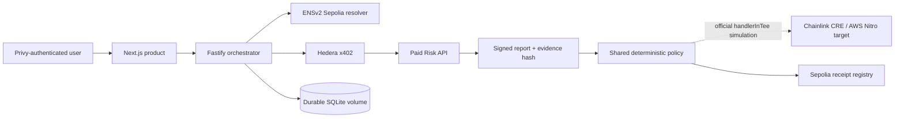

# AgentDock

AgentDock is a public testnet marketplace and policy-controlled execution platform for AI agent services. Providers publish ENS-identified, x402-priced services. Users authorize an agent, approve payment, receive signed delivery evidence, evaluate policy, and anchor the final receipt on Sepolia.

- **Live product:** https://agentdock-web-pi.vercel.app
- **Service catalog:** https://agentdock-web-pi.vercel.app/services
- **Workflow console:** https://agentdock-web-pi.vercel.app/workflow
- **Provider console:** https://agentdock-web-pi.vercel.app/providers

## What is real

| Layer           | Implementation                                                             | Status                          |
| --------------- | -------------------------------------------------------------------------- | ------------------------------- |
| Authentication  | Privy email/wallet login and server JWT verification                       | Live                            |
| Agent authority | ENSv2 resolver text records on Sepolia                                     | Live                            |
| Marketplace     | Durable provider catalog with authenticated ownership                      | Live                            |
| Payment         | Hedera testnet x402, capped at 10,000 tinybars per report                  | Live                            |
| Delivery        | EVM balance report with SHA-256 evidence hash and Ed25519 signature        | Live                            |
| Policy          | Shared deterministic evaluator executed by the CRE `handlerInTee` workflow | Official CRE simulator verified |
| Receipt         | `WorkflowReceiptRegistry` on Sepolia                                       | Live                            |

The CRE portion is truthfully labelled **simulator verified**. Chainlink confirmed that official confidential-workflow simulation is accepted for judging; real confidential deployment remains access-gated. ENS, Hedera payment, signed delivery, authentication, storage, and Sepolia receipts are not mocked.

## Architecture



The orchestrator enforces this state machine:

```text
DRAFT → ACTIVE → SERVICE_DISCOVERED → PAYMENT_QUOTED
→ PAYMENT_AUTHORIZED → PAYMENT_SETTLED → REPORT_RECEIVED
→ PRIVATE_EVALUATION_RUNNING → COMPLETED | REQUIRES_APPROVAL
```

Users cannot invoke arbitrary transitions in the authenticated deployment. Workflows and services are isolated by Privy user ID.

## Customer flow

1. Sign in with email OTP or an external wallet.
2. Browse ENS-identified services and their tinybar prices.
3. Create any number of isolated workflows.
4. Select a paid service.
5. Verify the agent's live ENS authority and required capability.
6. Enter the EVM address to assess.
7. Explicitly approve the displayed Hedera testnet charge.
8. Inspect the payment state, signed report, evidence hash, and Ed25519 signature.
9. Set the private policy threshold.
10. Evaluate the policy and open the confirmed Sepolia receipt.

## Provider flow

1. Sign in and open `/providers`.
2. Publish a provider name, ENS name, capability, public endpoint, description, and tinybar price.
3. AgentDock reads the ENS authority and requires:
   - active, unexpired authority;
   - the advertised capability;
   - an endpoint matching the listing.
4. The service appears in the public catalog.
5. The provider dashboard displays owned services, verified deliveries, and earned tinybars.

Expected ENS text records:

```text
agentdock.role
agentdock.capabilities
agentdock.expiresAt
agentdock.endpoint
agentdock.x402Network
agentdock.policyHash
agentdock.revokedAt          # optional
```

## Verified end-to-end evidence

One explicitly approved paid workflow completed on 2026-09-13:

| Evidence             | Value                                                                                                                                                                      |
| -------------------- | -------------------------------------------------------------------------------------------------------------------------------------------------------------------------- |
| Workflow             | `production-proof-1789310883504`                                                                                                                                           |
| ENS authority        | `agentdock.eth`                                                                                                                                                            |
| Hedera payment       | [`0.0.9185802@1789310877.433059891`](https://hashscan.io/testnet/transaction/0.0.9185802@1789310877.433059891)                                                             |
| Transfer             | `10,000` tinybars from `0.0.8318923` to `0.0.8318774`, `SUCCESS`                                                                                                           |
| Signed evidence hash | `0xf84c076e05b0e593ec2d563f259c4a4618737c57c51e66ec0c5cbc4a0ea0f3cc`                                                                                                       |
| Policy decision      | `COMPLETED`                                                                                                                                                                |
| Decision hash        | `0xe3d8223209e131997922cdccc67ca08819c01af73805bbac363911b32eee92cb`                                                                                                       |
| Receipt registry     | [`0x70fa78b86d6e1992989c98ddcbf61162a80a8c06`](https://sepolia.etherscan.io/address/0x70fa78b86d6e1992989c98ddcbf61162a80a8c06)                                            |
| Sepolia receipt      | [`0x466d5ec559b09d626db5d0d2b39195765b74739fd52b49069b9030666286bdfe`](https://sepolia.etherscan.io/tx/0x466d5ec559b09d626db5d0d2b39195765b74739fd52b49069b9030666286bdfe) |

Additional ENS, deployment, CRE, and Hedera evidence is maintained in [`progress.md`](./progress.md).

## Repository

```text
apps/web                Next.js public product and authenticated consoles
apps/api                Fastify orchestrator, Privy verification, receipts
apps/risk-api           Hedera x402-gated signed report provider
packages/domain         Workflow state machine and shared policy evaluator
packages/ens            ENS authority adapter
packages/hedera         Hedera settlement verification
packages/chainlink-cre  CRE handlerInTee workflow
packages/contracts      Sepolia receipt registry
packages/phase-zero     Reproducible network proof runners
```

## Local development

Requirements: Node.js 22+, pnpm 11.25.0, testnet accounts, and a Privy app.

```bash
pnpm install
cp .env.example .env.local
pnpm dev
```

Default ports:

```text
Web          http://localhost:3000
Orchestrator http://localhost:4000/health
Risk API     http://localhost:4001/health
```

Core environment groups are documented in [`.env.example`](./.env.example). Keep all private values in local/Fly/Vercel secret stores. The web app receives only `NEXT_PUBLIC_PRIVY_APP_ID`; `PRIVY_APP_SECRET`, wallet keys, Hedera keys, and the report-signing PEM are server-only.

Run verification:

```bash
pnpm typecheck
pnpm test
pnpm build
```

Network proof commands:

```bash
pnpm phase-zero:hedera
pnpm phase-zero:ens
pnpm --filter @agentdock/phase-zero ens:authority
```

## Deployment

- `apps/web`: Vercel with `NEXT_PUBLIC_API_URL` and `NEXT_PUBLIC_PRIVY_APP_ID`.
- `apps/api`: Fly.io with a persistent volume and server-only ENS, Hedera, Privy, and Sepolia secrets.
- `apps/risk-api`: Fly.io with a persistent volume, Hedera x402 configuration, risk-data RPC, and Ed25519 PKCS8 signing key.

Fly configurations are in [`fly.api.toml`](./fly.api.toml) and [`fly.risk-api.toml`](./fly.risk-api.toml).

## Security model and current limits

- Every paid action requires explicit UI confirmation.
- Client spend controls allow Hedera HBAR only and cap each payment at 10,000 tinybars.
- The API verifies Privy JWTs and scopes workflows/services to their owners.
- Only hashes, namehashes, payment references, status, and decision hashes go onchain.
- Private keys, raw policy inputs, and PEM material are never written to receipts.
- This is a testnet product. The current payer is an AgentDock testnet operator; production requires user credits or user-funded Hedera payment authorization.
- The current persistent SQLite deployment is appropriate for the single-machine testnet release; multi-region production requires managed storage and migrations.

See [`docs/DEMO_SCRIPT.md`](./docs/DEMO_SCRIPT.md) for the recording sequence.
